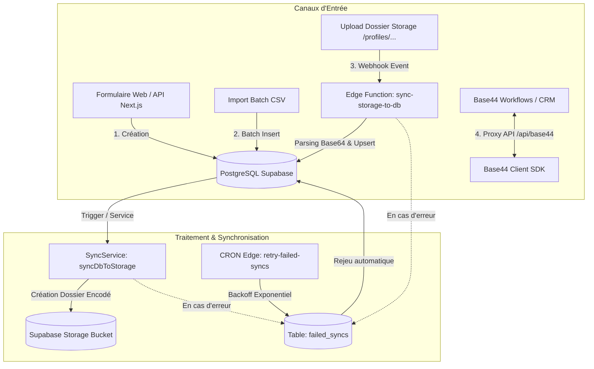

# 🌟 Fantazi-Land — Plateforme & Agence de Booking pour Créatrices de Contenu

[](https://nextjs.org/)
[](https://www.typescriptlang.org/)
[](https://tailwindcss.com/)
[](https://supabase.com/)
[](https://app.base44.com/apps/6a8ea8ad929a72d7ec63fc9d)
[](https://vitest.dev/)

**Fantazi-Land** est une plateforme web moderne (site vitrine marketing + application SaaS complète) conçue pour une agence de booking de créatrices de contenu. Elle automatise la création, l'indexation et la synchronisation des profils à partir de téléversements de dossiers dans **Supabase Storage** et connecte les flux utilisateurs au workflow **Base44**.

🔗 **Application Base44 liée :** [Base44 Booking App (ID: `6a8ea8ad929a72d7ec63fc9d`)](https://app.base44.com/apps/6a8ea8ad929a72d7ec63fc9d)

---

## 🎯 Fonctionnalités Principales

### 🌐 1. Site Vitrine & Catalogue Public
* **Vitrine & Découverte** : Exploration des profils de créatrices avec filtrage par catégorie (*Photographie, Vidéographie, Contenu Mode, Beauté, Lifestyle, Gaming*).
* **Fiches Détaillées** : Tarifs de base, calendrier de disponibilités, portfolio d'images/vidéos, liens sociaux et statistiques de performance.
* **Système d'Avis & Notations** : Évaluations clients vérifiées avec recalcul automatique de la note moyenne (`avg_rating`) et du total d'avis.

### 📁 2. Création Automatique via Dossiers Supabase Storage
* **Indexation par Détection de Dossiers** : Téléversez simplement un dossier dans le bucket Supabase `profiles` pour générer automatiquement le profil en base de données.
* **Format d'encodage robuste** : 
  `{Slug_Nom}__{Slug_Catégorie}__{Métadonnées_Base64_JSON}`
* **Synchronisation Bi-directionnelle** :
  * **Storage ➔ DB** : Déclenché par les Webhooks / Edge Functions dès qu'un dossier est créé.
  * **DB ➔ Storage** : Génération et mise à jour automatique des dossiers lors de la création ou modification via formulaire web.
* **Résilience & Dead Letter Queue (DLQ)** : Enregistrement de tout échec de synchronisation dans `failed_syncs` avec rejeu automatique par backoff exponentiel.

### ⚡ 3. Workflows & Gestion Utilisateurs Base44
* Intégration native avec l'API CRUD **Base44** (`/entities/User`).
* Synchronisation des comptes administrateurs et utilisateurs.
* Proxy API sécurisé pour consommer l'API Base44 sans exposer la clé API au client.

### 📅 4. Gestion des Réservations (Bookings)
* Demandes de devis et réservations de prestations.
* Suivi des états de projet (`pending` ➔ `confirmed` ➔ `in_progress` ➔ `completed` ➔ `cancelled`).
* Incrémentation automatique du compteur de projets réussis de la créatrice.

---

## 🏗️ Architecture & Flux de Synchronisation



---

## 🛠️ Stack Technologique

| Couche | Technologies |
| :--- | :--- |
| **Frontend** | [Next.js 14](https://nextjs.org/) (App Router), [React 18](https://react.dev/), [Tailwind CSS](https://tailwindcss.com/), [Framer Motion](https://www.framer.com/motion/) |
| **Backend API** | Next.js 14 API Routes, [Zod](https://zod.dev/) (Validation), Architecture en couches (Repositories & Services) |
| **Base de Données** | [PostgreSQL (Supabase)](https://supabase.com/) avec Row Level Security (RLS) et Triggers |
| **Stockage & Fichiers** | Supabase Storage (Buckets `profiles`, `avatars`) |
| **Edge Functions** | Deno TypeScript (`sync-storage-to-db-v2`, `sync-db-to-storage`, `retry-failed-syncs`) |
| **Intégration Externe** | [Base44 API](https://app.base44.com/apps/6a8ea8ad929a72d7ec63fc9d) (Gestion des utilisateurs et workflows) |
| **Qualité & Tests** | [Vitest](https://vitest.dev/) (Tests unitaires & intégration), [Playwright](https://playwright.dev/) (E2E) |
| **Déploiement** | [Vercel](https://vercel.com/) (Edge Network, région `cdg1` Paris) |

---

## 📂 Structure du Répertoire

```
fantazi-land/
├── app/                            # Next.js 14 App Router
│   ├── (public)/                   # Vitrine publique (SSR/SEO marketing)
│   │   ├── layout.tsx
│   │   ├── page.tsx                # Accueil & Catalogue des créatrices
│   │   └── profiles/[id]/page.tsx  # Fiche détaillée créatrice
│   ├── (dashboard)/                # Espaces connectés (Créatrices & Admins)
│   │   ├── dashboard/page.tsx      # Tableau de bord créatrice
│   │   ├── bookings/page.tsx       # Gestion des réservations
│   │   └── reviews/page.tsx        # Avis reçus
│   └── api/                        # API Routes RESTful
│       ├── profiles/               # CRUD & filtres profils
│       │   ├── route.ts
│       │   ├── [id]/route.ts
│       │   └── import-csv/route.ts # Import CSV batch
│       ├── bookings/               # Réservations & statuts
│       ├── reviews/                # Avis & notation
│       ├── upload/                 # Téléversement de fichiers/avatars
│       ├── base44/users/           # Proxy sécurisé Base44
│       ├── webhooks/storage-sync/  # Webhook de synchronisation Storage
│       └── failed-syncs/           # Dead Letter Queue monitoring & retries
│
├── components/                     # Composants UI (Atomic Design)
│   ├── atoms/                      # Button, Badge, StarRating, Avatar...
│   ├── molecules/                  # ProfileCard, SearchBar, FilterChip...
│   ├── organisms/                  # ProfileGrid, ProfileForm, CSVImporter...
│   └── navigation/                 # Navbar, Sidebar, Footer
│
├── lib/                            # Couche Métier & Utilitaires
│   ├── auth.ts                     # Authentification JWT & Rôles RBAC
│   ├── errors.ts                   # Gestion centralisée des erreurs ApiError
│   ├── schemas.ts                  # Schémas de validation Zod
│   ├── supabase.ts                 # Client Supabase (Public + Service Role)
│   ├── types.ts                    # Interfaces TypeScript centralisées
│   ├── clients/                    # Clients SDK externes
│   │   └── base44.client.ts        # Client typé pour l'API Base44
│   ├── repositories/               # Couche d'accès aux données (Anti-N+1)
│   │   ├── profiles.repository.ts
│   │   ├── bookings.repository.ts
│   │   ├── reviews.repository.ts
│   │   └── dlq.repository.ts
│   └── services/                   # Couche logique métier
│       ├── profiles.service.ts
│       ├── bookings.service.ts
│       ├── reviews.service.ts
│       ├── sync.service.ts
│       └── base44-user.service.ts
│
├── supabase/                       # Configurations Supabase
│   ├── migrations/                 # 7 Migrations SQL (Profiles, RLS, DLQ...)
│   ├── functions/                  # Edge Functions Deno
│   │   ├── sync-storage-to-db-v2/
│   │   ├── sync-db-to-storage/
│   │   └── retry-failed-syncs/
│   ├── config.toml
│   └── seed.sql                    # Données de test et démonstration
│
├── docs/                           # Documentation Technique
│   ├── ARCHITECTURE.md             # Architecture globale et flux
│   ├── DATABASE.md                 # Schéma PostgreSQL et RLS
│   ├── API.md                      # Spécification OpenAPI / REST
│   └── DEPLOYMENT.md               # Guide de déploiement Vercel
│
├── tests/                          # Suite de tests automatisés
│   ├── unit/                       # Tests unitaires (Sync, Zod, Base44)
│   └── integration/                # Tests d'intégration API
│
├── vercel.json                     # Configuration de production Vercel
└── package.json
```

---

## 🚀 Démarrage Rapide

### 1. Prérequis
* **Node.js** >= 18.17.0
* **npm** >= 9.0.0
* **Git**
* Un projet **Supabase** (Local via CLI ou hébergé)
* Un compte / application **Base44**

### 2. Installation
```bash
# 1. Cloner le dépôt
git clone <URL_DU_REPO> agence-de-booking
cd agence-de-booking

# 2. Installer les dépendances
npm install

# 3. Configurer l'environnement
cp .env.example .env.local
```

### 3. Variables d'Environnement (`.env.local`)
Renseignez les variables indispensables :
```env
# Supabase
NEXT_PUBLIC_SUPABASE_URL=https://votre-projet.supabase.co
NEXT_PUBLIC_SUPABASE_ANON_KEY=eyJhbGciOi...
SUPABASE_SERVICE_ROLE_KEY=eyJhbGciOi...

# Base44 Workflow API
BASE44_API_URL=https://agence-de-booking-crud-ec63fc9d.base44.app/api
BASE44_API_KEY=5f77c7690c884054ba1d3f2c75961284

# Application
NEXT_PUBLIC_APP_URL=http://localhost:3000
NODE_ENV=development
```

### 4. Base de Données & Migrations
```bash
# Lancer Supabase localement (optionnel)
npx supabase start

# Appliquer les migrations
npm run db:migrate

# Injecter les données de test
npm run db:seed
```

### 5. Lancer le Serveur de Développement
```bash
npm run dev
```
Ouvrez [http://localhost:3000](http://localhost:3000) dans votre navigateur.

---

## 🧪 Tests & Qualité de Code

```bash
# Vérification stricte des types TypeScript
npm run type-check

# Lancer la suite de tests unitaires et d'intégration
npm test

# Lancer les tests en mode watch
npm run test:watch

# Couverture de code
npm run test:coverage

# Tests End-to-End avec Playwright
npm run test:e2e
```

---

## 🔌 Référence Rapide de l'API

### Profils (`/api/profiles`)
* `GET /api/profiles` : Liste des profils avec filtres (`?category=Photographie&search=Marina&limit=10&sortBy=rating`).
* `POST /api/profiles` : Création d'un profil (déclenche la synchronisation vers Supabase Storage).
* `GET /api/profiles/:id` : Fiche complète avec statistiques, portfolio et avis.
* `PUT /api/profiles/:id` : Mise à jour du profil.
* `DELETE /api/profiles/:id` : Suppression du profil.
* `POST /api/profiles/import-csv` : Importation par lot de profils via fichier CSV.

### Réservations (`/api/bookings`)
* `GET /api/bookings?profileId=:id` : Liste des réservations d'une créatrice.
* `POST /api/bookings` : Création d'une réservation de projet.
* `PATCH /api/bookings/:id` : Mise à jour du statut (`completed` met à jour automatiquement les statistiques de la créatrice).

### Avis (`/api/reviews`)
* `GET /api/reviews?profileId=:id` : Avis clients reçus.
* `POST /api/reviews` : Dépôt d'avis (recalcule automatiquement la note moyenne).

### Base44 Users (`/api/base44/users`)
* `GET /api/base44/users` : Liste des utilisateurs Base44 avec pagination et filtres (`?limit=10&sort_by=-created_date`).
* `POST /api/base44/users` : Création d'un utilisateur Base44 (`{ email, full_name, role }`).
* `PUT /api/base44/users/:id` : Modification d'un utilisateur.
* `DELETE /api/base44/users/:id` : Suppression (soft-delete).

---

## 🚢 Déploiement en Production (Vercel)

Le projet est préconfiguré pour un déploiement optimal sur **Vercel** :
1. Poussez le code sur la branche `main` de votre dépôt Git.
2. Connectez le dépôt sur [Vercel](https://vercel.com/new).
3. Ajoutez les variables d'environnement dans **Settings > Environment Variables**.
4. Déployez ! Le fichier [`vercel.json`](file:///C:/Users/Di-vibez-ent/Lucky_dev/Agence%20de%20Booking/vercel.json) configure automatiquement la région `cdg1` (Paris), les timeouts étendus et les en-têtes de sécurité HTTP.

Consultez le guide détaillé : [`docs/DEPLOYMENT.md`](file:///C:/Users/Di-vibez-ent/Lucky_dev/Agence%20de%20Booking/docs/DEPLOYMENT.md).

---

## 📄 Licence
Ce projet est sous licence privée © **Fantazi-Land**. Tous droits réservés.
